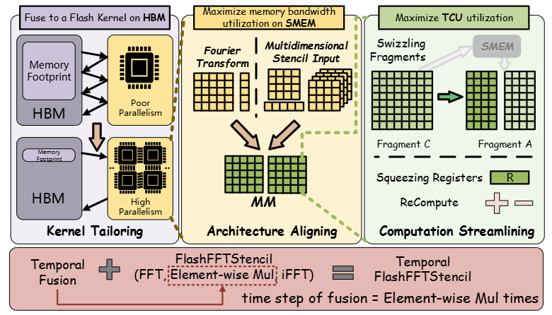

# FlashFFTStencil: Bridging Fast Fourier Transforms to Memory-Efficient Stencil Computations on Tensor Core Units

This repository contains the official code for FlashFFTStencil, a memory-efficient stencil computing system designed to bridge fast Fourier transforms to fully-dense stencil computations on Tensor Core Units.

FlashFFTStencil demonstrates remarkable efficiency in stencil computations, achieving an average speedup of 2.57× over the current state-of-the-art methods. Notably, in 1D cases, it achieves an exceptional 103.0× speedup compared to stencil implementations based on cuFFT.


**FlashFFTStencil: Bridging Fast Fourier Transforms to Memory-Efficient Stencil Computations on Tensor Core Units (PPoPP'25)** \
Paper: https://ppopp25.sigplan.org/track/PPoPP-2025-Main-Conference-1 \
Blog: https://mp.weixin.qq.com/s/KBUiKvvXqAHB0YC5XdQ4ww




## Contact

If you have any questions or would like to discuss more detail, please feel free to reach out to Haozhi at **haozhi.han@stu.pku.edu.cn**.


## Installation

Recommended Setup:

We suggest utilizing the Nvidia PyTorch Docker container, as this library has been developed and validated using version 23.05.

* This library has been tested with CUDA 12.1 and its corresponding toolkit.
* While our testing was conducted on A100 and H100 GPUs, it should work seamlessly on any Ampere/Hopper architecture (e.g., 3090, 4090).
* PyTorch 2.0 is Required (for benchmarking only)

Verifying CUDA Versions:
* Run `nvcc --version` to confirm your CUDA toolkit version. The Docker container we provide includes version 12.1.
* Run `nvidia-smi` to verify your CUDA driver version. Our Docker container also uses version 12.1.

You can install from source:
```
cd src
nvcc ./1D/1d_main.cu -o 1d.out -lcufft -O3 --use_fast_math --gpu-architecture=sm_xx
nvcc ./2D/2d_main.cu -o 2d.out -lcufft -O3 --use_fast_math --gpu-architecture=sm_xx
nvcc ./3D/3d_main.cu -o 3d.out -lcufft -O3 --use_fast_math --gpu-architecture=sm_xx
```


## How to Use FlashFFTStencil

You can run `FlashFFTStencil` in the following input format.
```
flashfftstencil_program shape input_size time_interation_size options
```
- `flashfftstencil_program` can be chosen from `1d`, `2d`, and `3d` for different dimensions.
- `shape` can be chosen by the different dimension:
    - `Heat-1D`, `1D5P` and `1D7P` for 1D
    - `Heat-2D`, `Box2D9P`, `Star2D9P` and `Box2D25P` for 2D
    - `Heat-3D` and `Box3d27P` for 3D
- `input_size` depends on the number of dimensions; the number of inputs required is equal to the number of dimensions.
- `time_interation_size` is the iteration time.
- `options`:
    - `--help` prints the help information.
    - `--custom` inputs the custom stencil kernel weights.


## Reference

Haozhi Han, Kun Li, Wei Cui, Donglin Bai, Yiwei Zhang, Liang
Yuan, Yifeng Chen, Yunquan Zhang, Ting Cao, and Mao Yang. 2025.
FlashFFTStencil: Bridging Fast Fourier Transforms to Memory-
Efficient Stencil Computations on Tensor Core Units. In The 30th
ACM SIGPLAN Annual Symposium on Principles and Practice of
Parallel Programming (PPoPP ’25), March 1–5, 2025, Las Vegas, NV,
USA. ACM, New York, NY, USA, 14 pages. https://doi.org/10.1145/3710848.3710897

